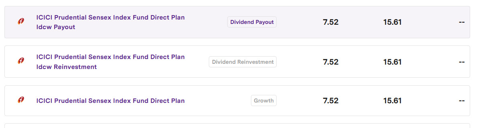
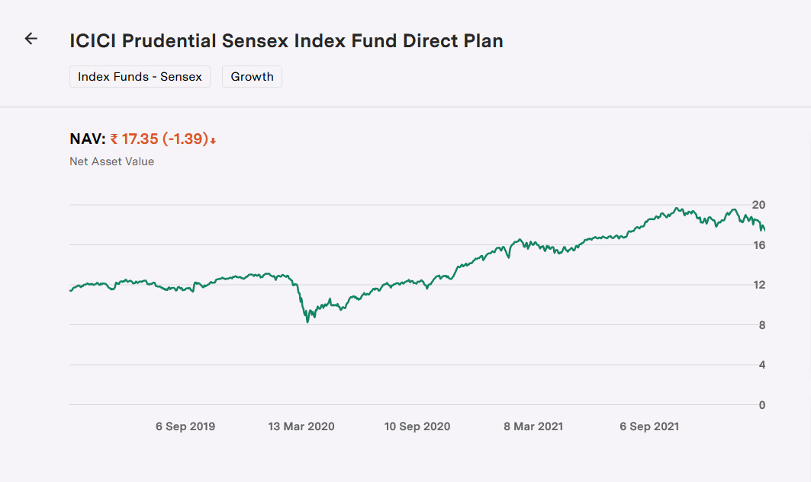
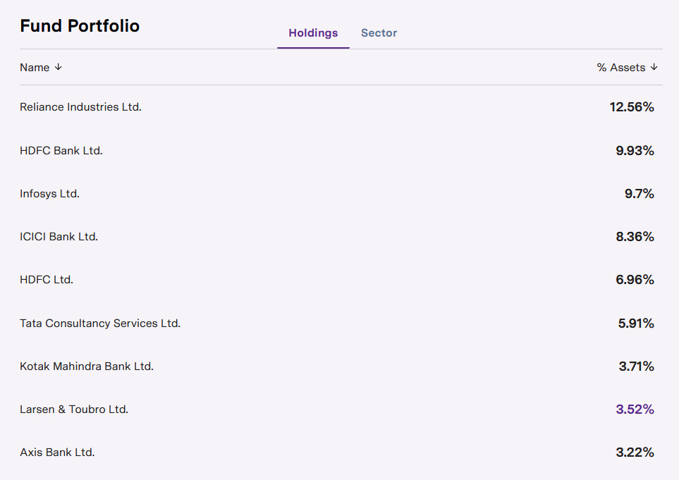
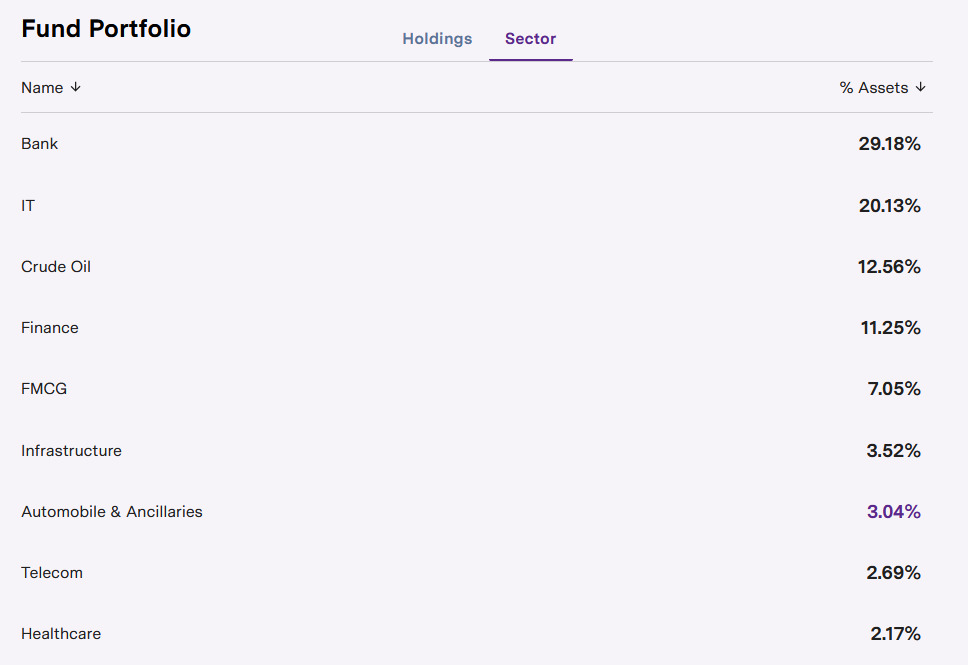

# Basic Financial and Misc Advice
Collection of basic financial information and advice about managing your money and other miscellaneous stuff, mostly centred around India.

## Starting Line

### Index Funds

Index funds are mutual funds (MF) that are a collection of stocks (portfolio) of the companies that have the greatest influence on the market and ultimately affect its performance. They are agood place to start investing your money for the longer run (> 10 years).

### Investing in Mutual Funds

*We will be using images from [Upstox](https://upstox.com/mutual-funds) as a reference.*  

**Dividend payout** if you want to earn a monthly/yearly amount from your investment. 
**Dividend reinvestment** if you want your earned dividend to be added to your invested amount. 
**Growth** for long term investments, >5 years.  

Don't get mislead by graphs. What goes up must come down. What you are looking for is stable growth over a number of years instead of sudden growths that look appealing.  

Keep an eye on the way your investment is distributed amongst various companies. If you would rather have your MF target major tech companies, look for those (generally reffered to as Bluechip).  

Also keep an eye on who is managing your fund. Google search for who they are and what their reputation is in the market.  

### Basic Strategies

#### Redundant Investment

Do not buy several mutual funds of "different" types. Most of them will share almost the same portfolio (distribution of companies), so there is no point. Buy one or at the most two MFs. 

#### Copy - Paste
Avoid mirroring someone else's investment. Everyone has different goals and risk appetites and you do not know what their decisions are based on. Do your own research and read about strategies. The idea is to invest independently. 

#### Beat the Bonds

The idea behind investing in MFs is you want to get better returns than if you had invested the same amount in a fixed deposit, savings account etc. So keep an eye on the projected return percentage over a number of years. 

#### Diversification

Keep your money distributed among different types of financial instruments like: fixed deposits, savings account, MFs, commodities, gold, real estate etc. (don't have to include all of them 😄, just an example). This is so your risk is distributed and the effects of a market crash in one sector (eg. real estate), are mitigated by investments in other sectors. 
For the nerds: [Modern Portfolio Theory - Diversification](https://en.wikipedia.org/wiki/Modern_portfolio_theory)

#### Medical Emergencies
Keep around 1 Lac handy in your savings account for medical emergencies. You will need it for a deposit and other expenses at a good hospital **before** you can claim insurance money. Cashless admission facilities are not available everywhere. Make a list of hospitals accordingly. 
